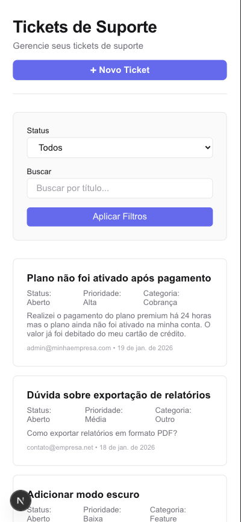
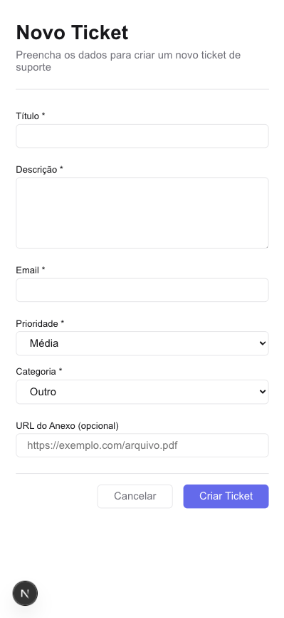
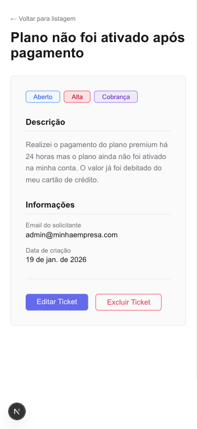
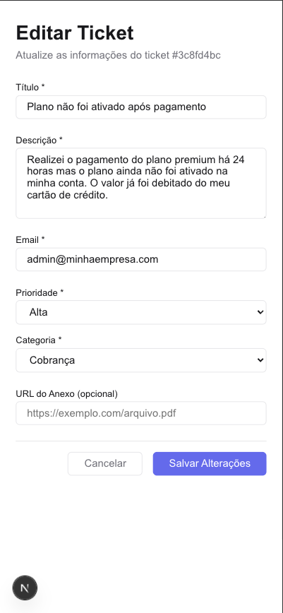
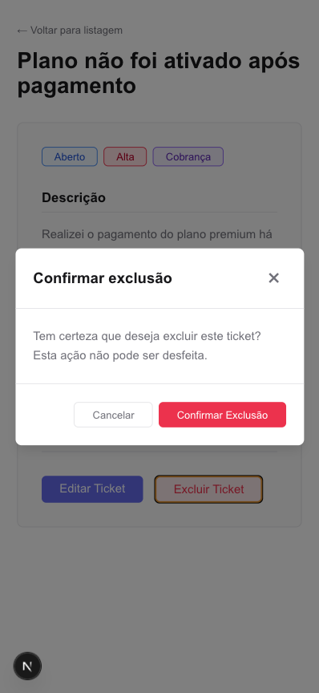

# Helpdesk Tickets – Technical Challenge

Helpdesk Tickets CRUD application developed as part of a technical challenge, focused on front-end best practices, clean architecture, coherent technical decisions, and responsible use of AI tools.

---

## 📌 About the Project

This project simulates a real-world **Helpdesk digital product**, allowing users to:

- Create support tickets
- List tickets with filters
- View ticket details
- Edit existing tickets
- Delete tickets with confirmation

The domain was intentionally chosen because it requires:
- richer form validations
- async state handling
- componentization
- solid UX and accessibility practices

---

## 🧱 Tech Stack

- **Next.js 16** (App Router)
- **React 19**
- **TypeScript**
- **SCSS Modules**
- **React Hook Form**
- **Zod**
- **Zustand** (planned for next steps)
- **Mock API using Next.js Route Handlers**

No external UI libraries were used, in accordance with the challenge requirements.

---
## Demontrations

Below are screenshots demonstrating the main user flows and features implemented in the application.

### 🏠 Ticket Listing
List of tickets with status, priority, category badges and filters.



---

### ➕ Create Ticket
Ticket creation form with validations and business rules applied.



---

### 📄 Ticket Details
Detailed view of a support ticket with all relevant information.



---

### ✏️ Edit Ticket
Editing an existing ticket with pre-filled data and validation.



---

### 🗑️ Delete Ticket
Confirmation modal preventing accidental deletion.




---

## ▶️ How to Run the Project

### Prerequisites
- Node.js 18+
- npm or yarn

### Steps

```bash
# Install dependencies
npm install

# Run in development mode
npm run dev
